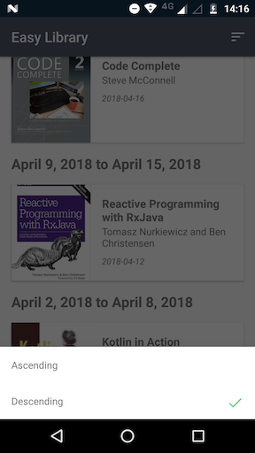

### EDIT:
This ended up becoming my lab for learning and testing new Android things. I completely changed my original Dagger setup, I added Data Binding and got rid of Kotlin Android Extensions, I wrote more tests, and I basically changed most of what I [originally had](https://github.com/tfcporciuncula/easy-library/tree/2defac20cd0e30bb437b473bad11b7c0c65049e6). From all those experiments, two blogposts were born:

- [MediatorLiveData to the Rescue](https://proandroiddev.com/mediatorlivedata-to-the-rescue-5d27645b9bc3)
- [Android Data Binding + ListAdapter](https://proandroiddev.com/android-data-binding-listadapter-9e72ce50e8c7)

# Easy Library

>Download the APK here: http://bit.do/easylibraryapk

Ever needed a simplified version of Blinkist's library view that allows you to browse your books in a convenient way? This is it! Except the list of books is made up and all the published dates are wrong.

## Screenshots
  

## Technologies

I chose my favorite technologies to work with when it comes to Android development:

- [Kotlin](https://kotlinlang.org/)
- [Architecture Components](https://developer.android.com/topic/libraries/architecture/)
- [Dagger](https://google.github.io/dagger/)
- ~[RxJava](https://github.com/ReactiveX/RxJava)~ [Coroutines](https://github.com/Kotlin/kotlinx.coroutines)
- [Retrofit](http://square.github.io/retrofit/)
- ~[Glide](https://github.com/bumptech/glide)~ [Coil](https://github.com/coil-kt/coil)
- ~[Data Binding](https://developer.android.com/topic/libraries/data-binding)~ [View Binding](https://developer.android.com/topic/libraries/view-binding)

And I added [RESTMock](https://github.com/andrzejchm/RESTMock) for the mock API.

## Architecture

It's a simple MVVM using [`ViewModel`](https://developer.android.com/topic/libraries/architecture/viewmodel) and [`LiveData`](https://developer.android.com/topic/libraries/architecture/livedata). Everything is glued together with Dagger, so any dependency can easily be swapped for testing.

## Data Flow

All my decisions towards how to handle the data were made based on my needs and opinion as an user:

- I want to be able to interact with the app as soon as possible (UI should be unblocked as soon as local persistence responds)
- I want to be able to sync the data with the server anytime I want (pull to refresh)
- The data must be up to date if I just opened the app
- Orientation changes must not trigger data syncs
- If a sync fails, I want to know about it so I'm aware the data I'm looking at might not be up to date
- I want to be aware of when the app is fetching data from the server (non-blocking UX loading state - pull to refresh again)
- If the data updates while I'm interacting with it, my interaction shouldn't be interfered (e.g. losing scroll state or blinking the whole list to add a new item should be avoided)

I wrote the data code with the goal of achieving every single item from this list - that and building a testable architecture were the two guiding principles for most of the code in the app.

The data is coming from RESTMock, and the [current configuration](https://github.com/tfcporciuncula/easy-library/blob/f9f018cd6a930d9ae3f733618441f3970c2315a8/app/src/main/java/com/blinkist/easylibrary/service/MockServer.kt#L15-L25) makes each request take 2 seconds to respond. The sequence of responses are configured in a way one can test different aspects of the app in a single run with only few data syncs:

- The first request returns a simple list with 16 books
- The second request returns the same list with one more book
- The third request returns the original list with 16 books
- The fourth request returns an error
- The rest of the requests will always return the same list with 16 books
