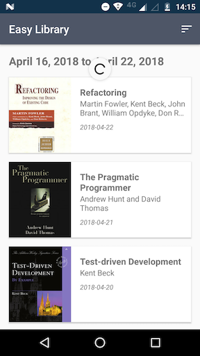
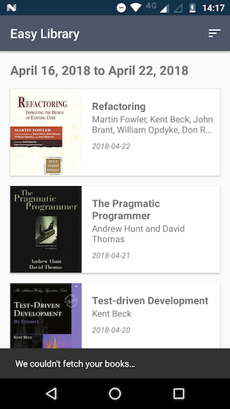
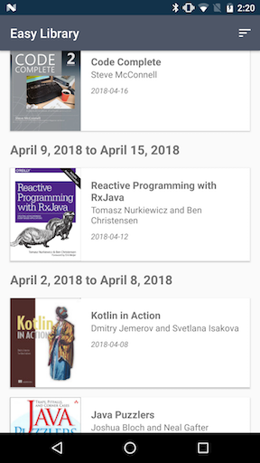

# Easy Library

>Download the APK here: http://bit.do/easylibraryapk

Ever needed a simplified version of Blinkist's library view that allows you to browse your books in a convenient way? This is it! Except the list of books is made up and all the published dates are wrong.

## Screenshots
  

## Technologies

I chose my favorite technologies to work with when it comes to Android development:

- [Kotlin](https://kotlinlang.org/)
- [Architecture Components](https://developer.android.com/topic/libraries/architecture/)
- [Dagger](https://google.github.io/dagger/)
- [RxJava](https://github.com/ReactiveX/RxJava)
- [Retrofit](http://square.github.io/retrofit/)
- [Glide](https://github.com/bumptech/glide)
- [Timber](https://github.com/JakeWharton/timber)

And I added [RESTMock](https://github.com/andrzejchm/RESTMock) for the mock API.

## Architecture

It's a simple MVVM with the new [ViewModel](https://developer.android.com/topic/libraries/architecture/viewmodel) and no [Data Binding](https://developer.android.com/topic/libraries/data-binding).

There's no state in the view (except for some disposables) or any other dependency besides the ViewModel. Android's standard way of injecting the ViewModel into the Activity is already pretty good, so I'm sticking to it instead of using Dagger. However, the ViewModel has its own dependencies, and Dagger provides those. The nice thing about providing the ViewModel dependencies through Dagger (besides all the good things dependency injection brings) is that once we want to test the ViewModel, we can simply switch the dependencies for mocks and test the ViewModel in isolation.

## Data Flow

All my decisions towards how to handle the data were made based on my needs and opinion as an user:

- I want to be able to interact with the app as soon as possible (UI should be unblocked as soon as local persistence responds)
- I want to be able to sync the data with the server anytime I want (pull to refresh)
- The data must be up to date if I just opened the app
- Orientation changes must not trigger data syncs
- If a sync fails, I want to know about it so I'm aware the data I'm looking at might not be up to date
- I want to be aware of when the app is fetching data from the server (non-blocking UX loading state - pull to refresh again)
- If the data updates while I'm interacting with it, my interaction shouldn't be interfered (e.g. losing scroll state or blinking the whole list to add a new item should be avoided)

I wrote the data code with the goal of achieving every single item from this list - that and building a testable architecture were the two guiding principles for most of the code in the app.

The data is coming from RESTMock, and the [current configuration](https://github.com/tfcporciuncula/easy-library/blob/master/app/src/main/java/com/blinkist/easylibrary/EasyLibraryApplication.kt#L35-L48) makes each request take 2 seconds to respond. The sequence of responses are configured in a way one can test different aspects of the app in a single run with only few data syncs:

- The first request returns a simple list with 16 books
- The second request returns the same list with one more book
- The third request returns the original list with 16 books
- The fourth request returns an error
- The rest of the requests will always return the same list with 16 books
